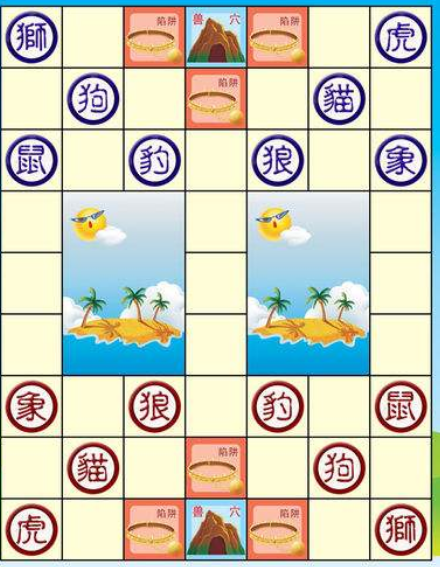
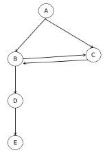
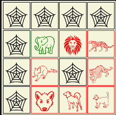
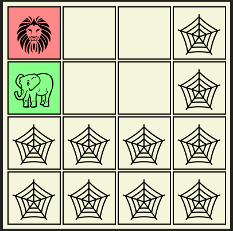

  [兽棋](https://github.com/weiyinfu/MammalChess)

# 游戏简介

兽棋中动物的排行有两种说法：
1. 三豹四虎，这种说法的好处是押韵，一象（4声）二狮（1声），三豹（4声）四虎（1声）。虽然那这么说不符合自然规律，但是老鼠吃大象更不符合自然规律，所以自然规律的重要性小于游戏的趣味性。
2. 三虎四豹，这种说法的好处是遵循自然规律，虎是最强大的猫科动物，狮子勉强可以与虎相争，豹显然是不敌老虎的。

同种动物相遇之后有两种方法：
1. 互相不能吃
2. 互相能吃：这条规则能够大大降低最后的和棋概率，使得游戏有胜有负
3. 互相抵消，同时消失：这条规则会产生较多的和棋

兽棋的棋盘有两种：
1. 斗兽棋，包括河流，陷阱，洞穴等地形。老鼠可以游泳，虎豹可以跳过河流。
2. 简单的4×4方格棋盘，对16张牌随机排序，依次摆放在4×4的方格棋盘上，两人轮流执行操作。

本程序实现如下：
1. 使用“三豹四虎”的说法：一象二狮三豹四虎五狼六狗七猫八鼠。
2. 使用4×4方格棋盘
3. 同种动物互相能吃

程序特点如下：
1. 最初整理unicode时，发现unicode中有各种各样的动物图标，因此想到兽棋游戏。本程序没有使用图片，而是使用Unicode字符。  
2. 本程序实现了简单的3层搜索AI

# 4×4棋盘游戏玩法
随机把16张牌扣在桌子上，两人约定好谁先操作。第一个人必然是翻开一张牌，翻开牌的颜色就是此人的颜色，另一种颜色就是另一个人的颜色。两人各自控制一种颜色的棋子，展开战斗。每人只能移动自己颜色的棋子，移动棋子可以移向空白处或者吃掉对方比自己小的棋子。  
当其中一方的棋子全部死掉或者无路可走后，该方为输，对方为赢。  
当连续若干步内没有发生吃子，游戏结果为平局。 

# 代码实现
res目录存放资源文件，index.html为入口网页。  
AI以web worker形式执行。  
为了加速AI开发迭代速度，便于制造多个AI进行PK，使用以下约定实现AI接口。  
ai的solve函数接受a，unkown，computerColor三个参数，返回一个对象，这个返回的对象必须包含strategy字段，其它字段可以任意添加。  

棋子编码：
* 0~7表示红色的象狮豹虎狼狗猫鼠
* 8～15表示绿色的象狮豹虎狼狗猫鼠
* 16表示未知
* 17表示空格

轮次turn：
* turn=0时轮到用户走
* turn=1时轮到对方走

# 斗兽棋的复杂形式
   
[游戏地址：17yy flash小游戏](http://www.17yy.com/f/play/75144.html)       
[斗兽棋百度百科](https://baike.baidu.com/item/%E6%96%97%E5%85%BD%E6%A3%8B/896091?fr=aladdin)    

# 搜索技术
## 迭代加深搜索
对着法进行合理排序能够增强alpha-beta剪枝的效果。如何对着法进行排序呢？
1. 贪心法，吃子的着法优先级高，优先移动威力大的棋子子
2. 走两步，评价该着法之后局面的分数，把该着法展开若干步可以得到效果更好的judge函数。
  
对排序之后的结果可以直接进行剪枝，如果某个着法分数太低，直接剪枝。  
迭代加深搜索的用途是：提高速度，快速剪枝，只搜索那些可能性较大的着法，降低分支因子，防止爆炸。分支因子降低了才有可能加大搜索深度，才能看得更长远。  

## 静态搜索
在发生激烈吃子的时候，局面评分可能偏悲观或者偏乐观，所以吃子之后要保证继续展开若干步，可能需要相应调整maxDepth这个参数来保证吃子之后足够搜索。  

## 定深搜索不收敛问题
对于计算机而言，它如果搜索了十步之后发现自己必胜，那么它不会去纠结中间过程，这会导致搜索不收敛，计算机的着法始终在中间徘徊。就像人自满了一样，它知道自己最终会达到同样的结果，所以放弃向着最后的结果努力。

如上图所示，有四个结点A，B，C，D，E。当前结点为A，A可以通过B，C两个中间状态到达D，E为必胜状态。如果搜索深度为5,第一条路径为ABDE，第二条路径为ACBDE。  
对于当前局面A而言，去B和去C收益相同。如果遇见B状态就选择去C的决策，遇见C状态就选择去B的决策，这就会导致状态在B和C之间来回震荡。  
解决方法有两种：
1. 引入梯度，对状态的评分需要跟深度挂钩。对于优势状态，深度越浅越好;对于劣势状态，深度越深越好。
2. 引入随机，如果某一状态有多种效果相同的决策，那么从这些决策里面随机选择一个而不是只选择特定一个返回，这样虽然依旧有可能形成循环但是存在跳出循环的可能性。

对于优势状态，深度越浅越好，score-depth。   
对于劣势状态，深度越深越好，score+depth。  
这就是使用depth实现马太效应。

## 优化judge函数
搜索法解决博弈问题必定需要贪心法评价局面，贪心法评价局面无法完全评价局面，它很容易失掉一些看似危险实则有利的着法，搜索法在搜索到一定深度之后再调用贪心法评价局面，这样能够是对局面的评估更加准确。  
所以，搜索相当于一个算子，贪心法评价局面也相当于一个算子，任何一个贪心法都可以使用搜索让它变得更精确。  
judge函数是跟博弈相关性最强的部分，程序员的下棋水平决定了judge函数的水平。  
优化judge函数是一个需要长期优化的问题，是一个可以没有固定答案最自由发挥的问题。  

## 长追问题
吃子类游戏存在长追问题，游戏双方来回走陷入死循环。  
长追可能作负，也可能判和。  
不管是作负还是判和，首要问题都是识别长追。  

给定一个操作序列，如何判断是否发生长追？  
追，必定是一个在跑，另一个在追。轮到追者走时，追者连续把一个棋子走两步就能吃掉跑者。  

最简单的长追：双方在同一个地方来来回回，有固定的周期。
周期不为2的长追：如下图所示，红方翻出了绿象，绿象只得赶紧逃命一步也不能停歇来躲避红鼠的追赶。最终结果就是两人绕着中间不停地转圈。对于这种环形长追如何识别？    

多处长追：以上只讨论了一对长追，实际可能有多对长追。这是又该如何判别长追？  

   
长追可能没有周期。如上图所示，轮到红方移动。当追者追击跑者时，跑者可能有一定的自由度可以跑往多个方向，如果跑者每次都随机选择逃跑方向，那么整个追击过程可以没有周期。

在解决定深搜索不收敛问题时，可以使用随机选择决策的方法。在处理长追时，随机选择决策同样能够减少长追的出现。  

## 翻牌类局面的评分
兽棋是一种“翻牌+吃子”游戏。中国象棋没有任何随机性，而兽棋有翻牌，翻牌引入了随机性。  
翻牌也是一种决策，如何评价翻牌的局面好坏？翻牌之后这张牌有若干种可能，对所有可能的情况求期望即可，也就是假设翻出来的牌的每一种可能并评估局面，把所有可能局面的分数求均值即可得到当前局面的分数。
